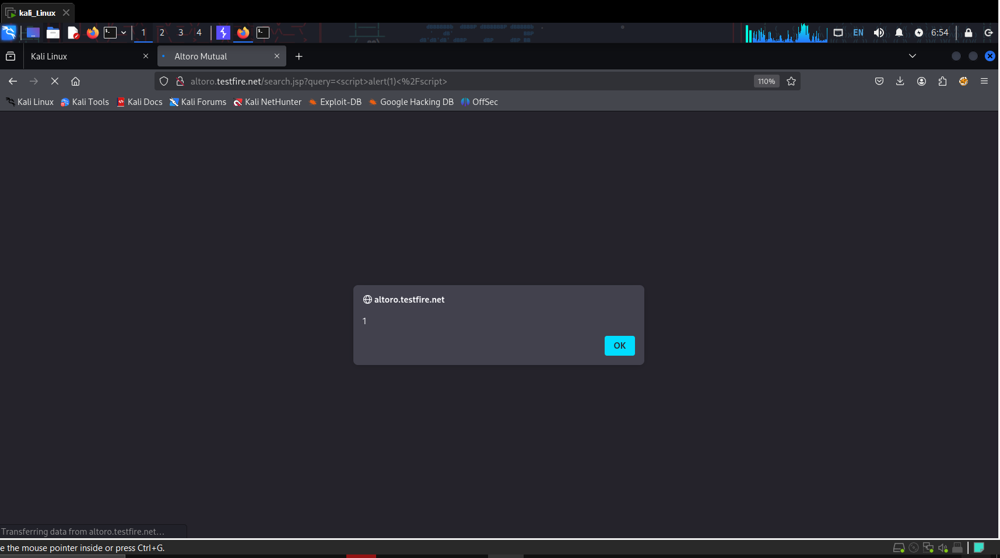
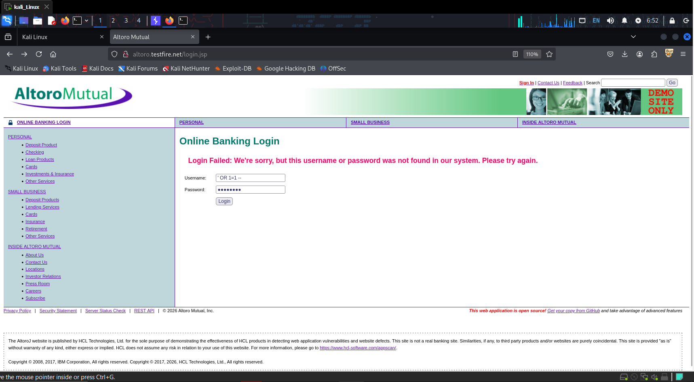

# 🛡️ Web Application Security Audit (Internee.pk - Assignment 6)

## 📌 Objective
The objective of this project was to perform a comprehensive security audit on a staging environment to identify critical vulnerabilities, specifically targeting SQL Injection (SQLi), Cross-Site Scripting (XSS), and Cross-Site Request Forgery (CSRF). 

## 🎯 Target Environment & Pivot
* **Initial Target:** OWASP Juice Shop (`demo.owasp-juice.shop`)
* **Active Target:** Altoro Mutual (`testfire.net`)
* *Environment Note:* During the designated testing window, the official OWASP Juice Shop server experienced a Heroku application crash. To ensure the audit was completed without delay, the testing scope was successfully pivoted to IBM's deliberately vulnerable Altoro Mutual banking application.

**Evidence of Initial Server Crash:**

## 🛠️ Tools & Methodology
* **Operating System:** Kali Linux
* **Web Proxy & Vulnerability Scanner:** Burp Suite Professional
* **Methodology:** Manual Payload Injection combined with Automated Active Scanning.

---

## 🔍 Vulnerability Findings & Evidence

### 1. Cross-Site Scripting (Reflected XSS)
* **Vulnerable Endpoint:** Search input field (`/search.jsp?query=`)
* **Injected Payload:** ``
* **Impact:** A lack of input sanitization allows an attacker to execute arbitrary JavaScript in the victim's browser, which can be weaponized for session hijacking or credential theft.
* **Execution Evidence:** 

### 2. SQL Injection (SQLi) Probing
* **Vulnerable Endpoint:** Authentication Portal (`/login.jsp`)
* **Payload Tested:** `' OR 1=1 --`
* **Analysis:** Probed the username field with a classic boolean-based SQL injection payload to test for authentication bypass vulnerabilities and database error handling.
* **Execution Evidence:**

### 3. Automated Security Assessment (Burp Suite Pro)
Following the manual verification of XSS and SQLi, an automated Active Scan was executed via Burp Suite Professional to map out deeper architectural flaws, including CSRF misconfigurations, cleartext submissions, and DOM-based manipulation.

* **Scan Summary:** 

* **Vulnerability Index:**

---
*This security audit was completed as part of a Cyber Security virtual internship.*
